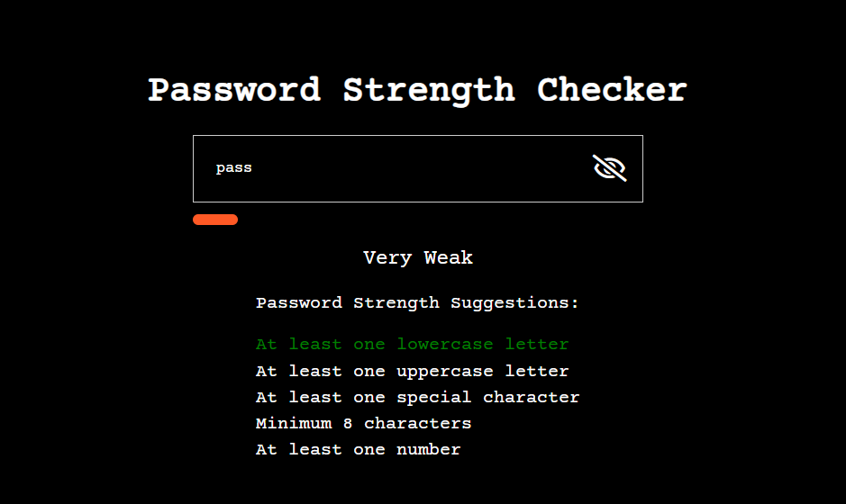
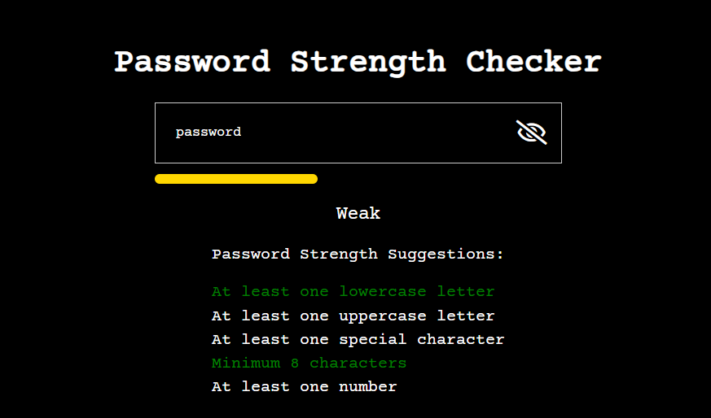
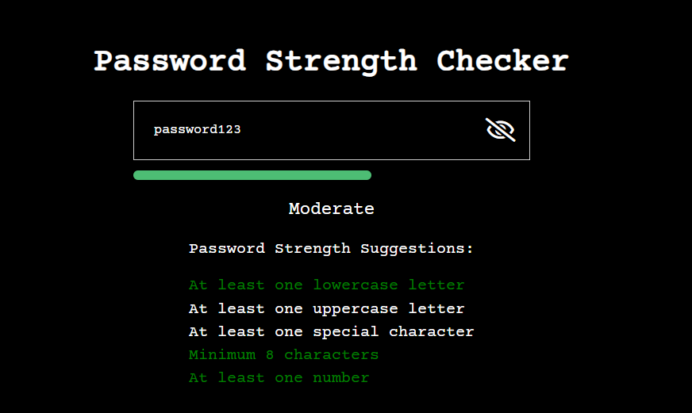
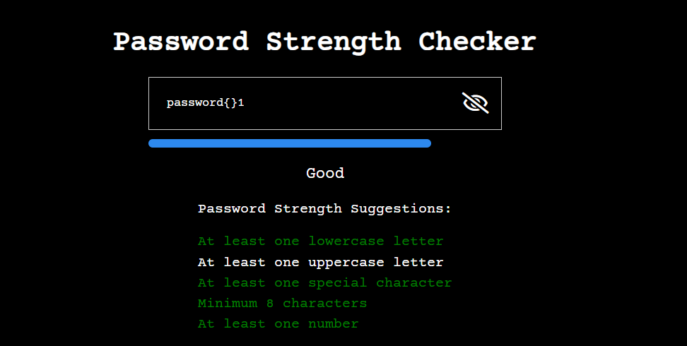
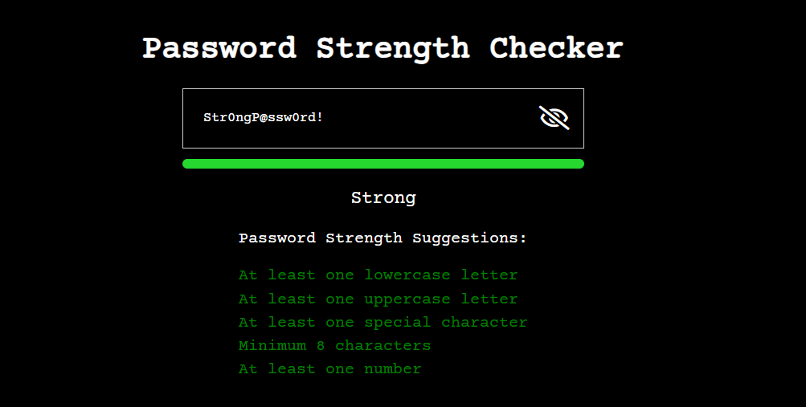

# Password Strength Checker 🔐

## Table of Contents
1. [Project Overview](#project-overview-)
2. [Installation](#installation-)
3. [Usage](#usage-)
4. [Password Strength Algorithm](#password-strength-algorithm-)
5. [Examples](#examples-)

## Project Overview 📝
The Password Strength Checker is a web-based application that evaluates the strength of a password based on various criteria. It provides real-time feedback to users as they type their password, indicating the strength level and highlighting which requirements are met. The application aims to encourage users to create strong and secure passwords.

## Installation ⚙️
To run the Password Strength Checker locally, follow these steps:

1. Clone the repository or download the source code files.
2. Open the `index.html` file in a web browser.

The application will be ready to use, and no additional setup is required.

## Usage 📖
1. Open the Password Strength Checker in a web browser.
2. Enter a password in the provided input field.
3. As you type, the application will provide real-time feedback on the password strength:
   - The strength meter will update dynamically, indicating the overall strength of the password.
   - The password requirements list will highlight which criteria are met.
4. Continue typing and refining your password until it meets the desired strength level.
5. Use the toggle button to show or hide the entered password.

## Password Strength Algorithm 🔒

### Strength Criteria
The password strength is evaluated based on the following criteria:
1. **Length**: The password should be at least 8 characters long. Passwords with 10 or more characters are considered even stronger.
2. **Lowercase Letters**: The password should contain at least one lowercase letter.
3. **Uppercase Letters**: The password should contain at least one uppercase letter.
4. **Numbers**: The password should contain at least one numeric digit.
5. **Special Characters**: The password should contain at least one special character.

### The "8 4 Rule"
The application follows the "8 4 Rule" for password strength:
- **8** = Minimum of 8 characters in length
- **4** = At least 1 lowercase letter, 1 uppercase letter, 1 number, and 1 special character

By adhering to the "8 4 Rule," users can create passwords that are significantly stronger than those that don't follow any guidelines. It is highly recommended to ensure that passwords for sensitive accounts, such as banking and financial websites, follow the "8 4 Rule" at a minimum.

### Strength Levels
The application defines the following strength levels:
- **Very Weak**: The password is less than 8 characters long.
- **Weak**: The password meets only one of the strength criteria.
- **Moderate**: The password meets two of the strength criteria.
- **Good**: The password meets three of the strength criteria.
- **Strong**: The password meets all four strength criteria and has at least 5 unique characters.

### Algorithm Flow
1. Initialize variables to track password length, strength score, and unique character count.
2. Iterate through each character of the entered password:
   - Check if the character is a lowercase letter, uppercase letter, number, or special character.
   - Increment the strength score based on the presence of each character type.
3. Calculate the number of unique characters in the password using a Set.
4. Determine the strength level based on the password length and strength score:
   - If the password is less than 8 characters long, mark it as "Very Weak".
   - If the password meets all four strength criteria and has at least 5 unique characters, mark it as "Strong".
   - Otherwise, assign the strength level based on the number of criteria met.
5. Update the strength meter and password requirements list based on the evaluated strength level.

## Examples 📌

### Example 1: Very Weak Password
Input:
```
pass
```
Output:
- Strength Meter: 20% filled, red color
- Strength Text: Very Weak
- Requirements:
  - ✓ At least one lowercase letter
  - ✕ At least one uppercase letter
  - ✕ At least one special character
  - ✕ Minimum 8 characters
  - ✕ At least one number

<p align="center">
  
  <br>
  <em>Example 1: Very Weak Password</em>
</p>

### Example 2: Weak Password
Input:
```
password
```
Output:
- Strength Meter: 40% filled, yellow color
- Strength Text: Weak
- Requirements:
  - ✓ At least one lowercase letter
  - ✕ At least one uppercase letter
  - ✕ At least one special character
  - ✓ Minimum 8 characters
  - ✕ At least one number

<p align="center">
  
  <br>
  <em>Example 12: Very Weak Password</em>
</p>


### Example 3: Moderate Password
Input:
```
password123
```
Output:
- Strength Meter: 60% filled, faded green color
- Strength Text: Moderate
- Requirements:
  - ✓ At least one lowercase letter
  - ✕ At least one uppercase letter
  - ✕ At least one special character
  - ✓ Minimum 8 characters
  - ✓ At least one number

<p align="center">
  
  <br>
  <em>Example 3: Moderate Password</em>
</p>

### Example 4: Good Password
Input:
```
password{}1
```
Output:
- Strength Meter: 80% filled, blue color
- Strength Text: Good
- Requirements:
  - ✓ At least one lowercase letter
  - ✕ At least one uppercase letter
  - ✓ At least one special character
  - ✓ Minimum 8 characters
  - ✓ At least one number

<p align="center">
  
  <br>
  <em>Example 4: Good Password</em>
</p>


### Example 5: Strong Password
Input:
```
Str0ngP@ssw0rd!
```
Output:
- Strength Meter: 100% filled, light green color
- Strength Text: Strong
- Requirements:
  - ✓ At least one lowercase letter
  - ✓ At least one uppercase letter
  - ✓ At least one special character
  - ✓ Minimum 8 characters
  - ✓ At least one number

<p align="center">
  
  <br>
  <em>Example 5: Strong Password</em>
</p>
